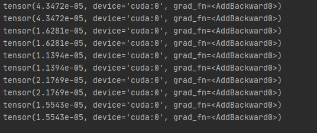

# AS-Net-pytorch
这份代码是对于CVPR 2020 Attention Scaling for Crowd Counting的复现

在理解原作者代码的基础上我补充了训练代码，不做保障，只是能跑起来训练，具体跑的结果我还没有，具体的训练细节也还没考虑，所以还不完整

论文：
[Attention Scaling for Crowd Counting](https://openaccess.thecvf.com/content_CVPR_2020/html/Jiang_Attention_Scaling_for_Crowd_Counting_CVPR_2020_paper.html)

作者代码主要有这么几个重要文件（都省略.py)
        test 作者调用的一个实例
        network 封装卷积单元，逆卷积单元
        models  封装整个网络
        crowd_count 封装了对网络的调用以及返回损失函数结果
        data_multithread 是个半成品，没有用
        data_multithread_preload 是数据加载类，仿照test例子加载数据
        data_path 是数据路径寻找，需要自己设置
        两条网络的前13个卷积层都是VGG16的，VGG16在这里下(密码：ica9）：
        [很大很大的VGG16](https://pan.baidu.com/s/12LVSJ5VYM4nSgPjdZ9Bvyg) 
  
  遇到几个大坑：
        作者用的是8线程加载数据，我的小破机吃不消，会报错，改成了单线程
        batch_size已经设置为1，如果CUDA显存还是爆，不要去修batch_size
        作者的把模型的一部分直接命名为VGG,但是这根本不是VGG，而且参数的键名与下载的VGG16参数都对不上，不能直接调用参数加载
       
       
  模型训练截图：
       
       
   
       
